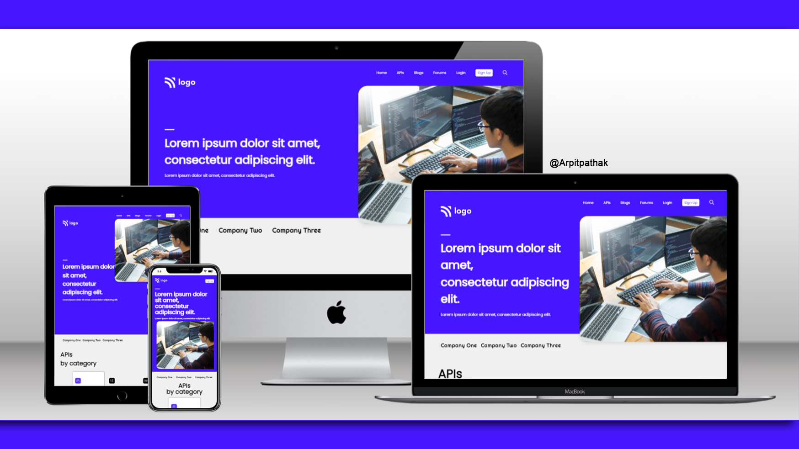

# Developer webpage

## Project 09 🚀 Website's [Live Link](https://developer-pro.netlify.app/)🔗

>by Arpit Pathak

Screenshot

website on different devices

## 📌 What I learned from this Project? 📝
- Learned how to make beautiful cards.
- Learned about `::placeholder` selector to style placeholder text
- Learned to use CSS position (Absolute & Relative) properties.
- Learned about using `::after` for adding arrow and style it. 
- Learned about Flexbox and its properties justify-content & align-items.
- Learned about pseudo classes `:first-child`, `:last-child` & `nth-child`.

## 📌 Time taken to finish this project ⏳
- 05 hours + 1 hour for making website responsive.
---

